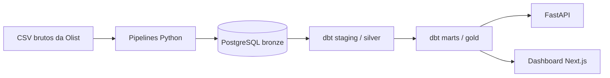
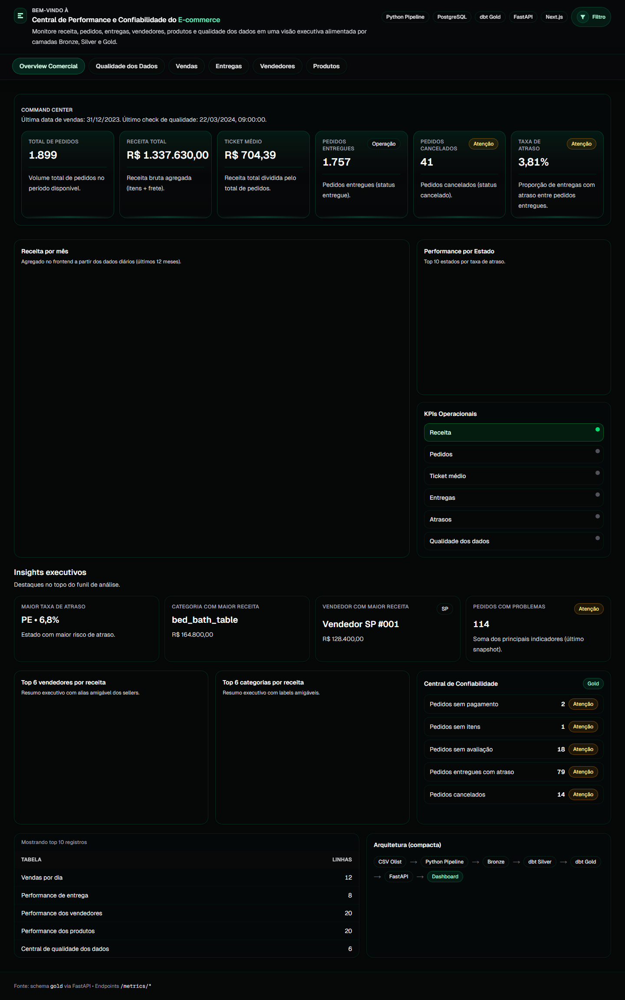
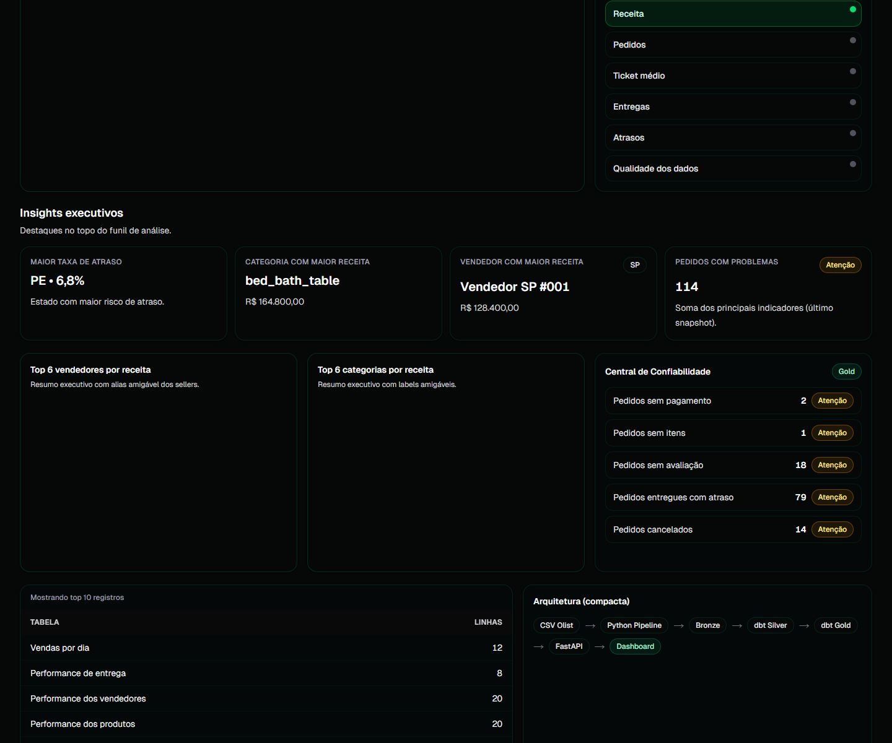

# ecommerce-data-reliability-platform

Plataforma de dados de e-commerce baseada no dataset publico da Olist, desenhada para demonstrar um fluxo completo de engenharia de dados: ingestao bronze, transformacoes dbt nas camadas silver e gold, API analitica e dashboard de consumo.

## Problema que o projeto resolve

O projeto simula o tipo de plataforma necessaria para transformar dados brutos de e-commerce em informacao confiavel para analise e tomada de decisao.

Na pratica, ele resolve estes pontos:

- centraliza dados dispersos em uma base unica e reproduzivel
- separa dado bruto, dado tratado e dado analitico
- cria rastreabilidade entre ingestao, transformacao e consumo
- disponibiliza metricas prontas para dashboard e monitoramento
- documenta o fluxo tecnico de ponta a ponta para portfolio e auditoria

## Arquitetura



### Componentes

- `data/`: arquivos brutos, amostras e artefatos processados
- `pipelines/`: scripts Python de setup e carga bronze
- `dbt/`: projeto dbt Core com staging, marts, seeds e testes
- `api/`: API FastAPI para exposicao das metricas de Gold
- `web/`: dashboard Next.js com TypeScript
- `docs/`: documentacao tecnica complementar
- `tests/`: testes automatizados e validacoes
- `.github/workflows/`: CI e automacoes futuras

## Stack usada

- Python 3.11+ para os pipelines e scripts de inicializacao
- PostgreSQL 16 via Docker Compose
- dbt Core 1.8 + `dbt-postgres`
- FastAPI para a camada de servico
- Next.js + TypeScript para o dashboard
- GitHub Actions para CI
- SQL como linguagem principal de modelagem analitica

## Fluxo dos dados

1. Os CSVs da Olist ficam em `data/raw/`.
2. `pipelines/init_database.py` cria os schemas `bronze`, `silver`, `gold` e `audit`.
3. `pipelines/load_bronze.py` carrega os arquivos para tabelas bronze no PostgreSQL.
4. O dbt le as fontes bronze e cria modelos staging na camada `silver`.
5. O dbt materializa as tabelas analiticas da camada `gold`.
6. A FastAPI consulta somente `gold` e expoe metricas consolidadas.
7. O dashboard Next.js consome a API e apresenta os indicadores.

## Camadas Bronze, Silver e Gold

### Bronze

- dado bruto, carregado quase como veio da fonte
- foco em preservacao e rastreabilidade
- cada CSV vira uma tabela no schema `bronze`
- inclui colunas tecnicas de ingestao para auditoria

### Silver

- camada de padronizacao e limpeza
- modelos staging do dbt em `dbt/models/staging`
- normaliza nomes, tipos e relacoes basicas
- prepara os dados para consumo analitico

### Gold

- camada de negocio e consumo
- fatos, dimensoes e marts no schema `gold`
- otimizada para API, dashboard e analises executivas
- concentra KPIs e metricas prontas para leitura

## Modelos dbt

### Staging / Silver

- `stg_customers`
- `stg_geolocation`
- `stg_orders`
- `stg_order_items`
- `stg_order_payments`
- `stg_order_reviews`
- `stg_products`
- `stg_product_category_name_translation`
- `stg_sellers`

### Gold

#### Dimensoes

- `dim_customers`
- `dim_dates`
- `dim_products`
- `dim_sellers`

#### Fatos

- `fct_orders`
- `fct_order_items`
- `fct_payments`
- `fct_reviews`

#### Marts

- `mart_sales_daily`
- `mart_delivery_performance`
- `mart_seller_performance`
- `mart_product_performance`
- `mart_data_quality_summary`

## Endpoints da API

A API consulta apenas as tabelas do schema `gold`.

| Metodo | Endpoint | Descricao |
| --- | --- | --- |
| `GET` | `/health` | Healthcheck da API e da conexao com o banco |
| `GET` | `/metrics/overview` | Visao geral com contagem de linhas, ultima data de vendas e ultima checagem de qualidade |
| `GET` | `/metrics/sales-daily` | Serie diaria de vendas e receita |
| `GET` | `/metrics/delivery-performance` | Indicadores de entrega por UF do cliente |
| `GET` | `/metrics/seller-performance` | Performance de vendedores |
| `GET` | `/metrics/product-performance` | Performance de produtos e categorias |
| `GET` | `/metrics/data-quality` | Resumo de qualidade de dados |

Swagger/OpenAPI:

```text
http://127.0.0.1:8000/docs
```

## Prints do dashboard

O dashboard foi construido para mostrar o valor analitico da camada Gold. As telas que melhor representam o projeto sao:

### Visao executiva



### Confiabilidade e insights



Essas capturas mostram a leitura principal do produto:

- visao executiva com KPIs principais
- grafico de vendas ao longo do tempo
- ranking de vendedores
- performance por produto e categoria
- leitura de qualidade de dados

## Como rodar localmente

### 1. Preparar variaveis

Copie o arquivo de exemplo:

```bash
cp .env.example .env
```

No Windows PowerShell:

```powershell
Copy-Item .env.example .env
```

### 2. Subir o PostgreSQL

```bash
docker compose up -d
```

### 3. Inicializar schemas

```bash
python pipelines/init_database.py
```

### 4. Carregar a camada Bronze

```bash
python pipelines/load_bronze.py
```

### 5. Configurar dbt

Copie o profile de exemplo:

```bash
cp dbt/profiles.yml.example dbt/profiles.yml
```

Depois rode os modelos a partir da pasta `dbt/`:

```bash
dbt debug --profiles-dir .
dbt run --profiles-dir .
dbt test --profiles-dir .
```

Para executar apenas Gold:

```bash
dbt run --profiles-dir . --select gold
dbt test --profiles-dir . --select gold
```

Se `dbt` nao estiver no PATH do Windows, use o executavel instalado pelo Python:

```powershell
$DbtExe = (py -3.12 -c "import sys; from pathlib import Path; print(Path(sys.executable).parent / 'Scripts' / 'dbt.exe')")
& $DbtExe debug --project-dir dbt --profiles-dir dbt
& $DbtExe run --project-dir dbt --profiles-dir dbt
& $DbtExe test --project-dir dbt --profiles-dir dbt
```

### 6. Subir a API

Na raiz do repo:

```bash
uvicorn api.app.main:app --reload --port 8000
```

### 7. Rodar o dashboard

```bash
cd web
npm install
npm run dev
```

Configure `web/.env.local` com base em `web/.env.local.example`.

## Aprendizados tecnicos

- separar ingestion, transformacao e consumo reduz o acoplamento do projeto
- Bronze/Silver/Gold facilita evolucao incremental e leitura tecnica
- dbt torna as transformacoes versionaveis e testaveis
- a API funciona melhor quando consulta apenas a camada Gold
- dashboard fica mais simples quando o contrato da API e estavel
- observabilidade com tabelas de auditoria ajuda a explicar o que entrou e o que foi processado
- documentacao tecnica no repo aumenta muito o valor de portfolio

## Documentacao complementar

- Arquitetura: [docs/architecture.md](docs/architecture.md)
- API: [docs/api.md](docs/api.md)
- Execucao local: [docs/how_to_run.md](docs/how_to_run.md)
- Workflow Git: [docs/git_workflow.md](docs/git_workflow.md)
